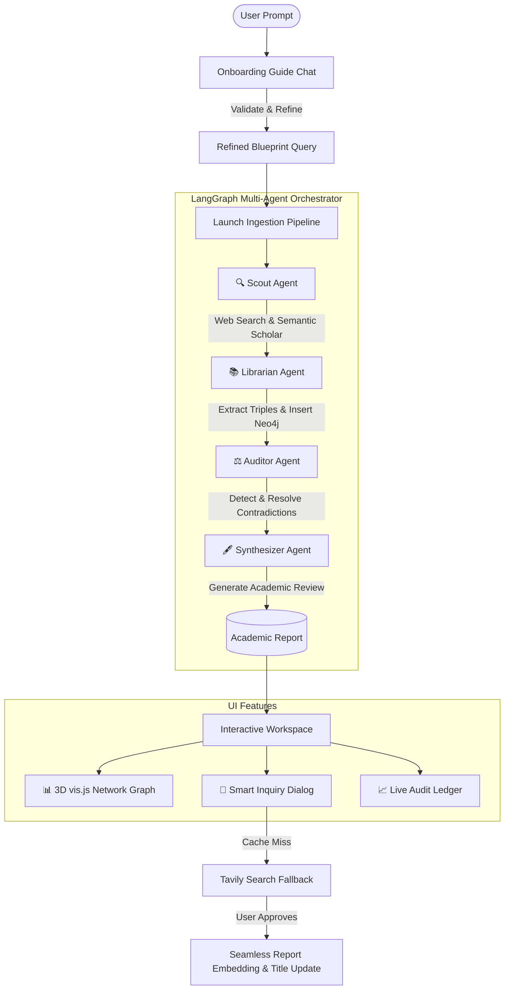

# 🧬 AuRA // Autonomous Research Assistant

AuRA (Autonomous Research Assistant) is a premium, high-performance academic literature review and discovery engine. Powered by a collaborative multi-agent architecture orchestrated via **LangGraph**, it scouts the web, extracts structured knowledge graphs, audits conflicting claims, and synthesizes publishing-grade academic reports.

---

## 🏛️ System Architecture

AuRA uses a stateful multi-agent system to handle complex research pipelines. Below is the workflow diagram mapping the agents and data flow:



### Agent Roles & Workflows
1. **🔍 Scout Agent (`src/scout.py`)**: Optimizes the research blueprint, queries web databases (Tavily/Google Search) and Semantic Scholar, scrapes content, and scores source credibility.
2. **📚 Librarian Agent (`src/librarian.py`)**: Structures in-memory matrices, extracts entity-relation-entity triples, and writes the nodes directly to Neo4j.
3. **⚖️ Auditor Agent (`src/auditor.py`)**: Scans for conflicting statements across papers, scores contradictions dynamically, and generates an audit log.
4. **🖋️ Synthesizer Agent (`src/synthesizer.py`)**: Weaves the gathered evidence, contradictions, and structured graph references into a peer-review-quality markdown document.

---

## ✨ Key Features

- **Adversarial Ingestion Pipeline**: Generates deep literature reviews, fully citation-supported, in a clean LaTeX/academic format.
- **Dynamic vis.js Knowledge Graph**: Interactive force-directed network showing sources, temporal data, and entities, filterable by node type and searchable by keyword.
- **Triples Downloader**: Click to download the extracted knowledge graph as a clean CSV format.
- **Live Audit Ledger**: Real-time counter of total graph triples exported, resolved contradictions, and sources analyzed.
- **Smart Inquiry Dialog**: Ask questions about the report. If the query falls outside the cached report, AuRA conducts a quick web search fallback, drafts a supplementary section, and seamlessly embeds it into the report, dynamically adjusting the main title to match the expanded scope.
- **API Settings Override**: Securely configure and save API credentials directly from the UI into your local `.env` file.

---

## 🚀 Setup & Installation

### Prerequisites
- Python 3.10 or higher
- A running Neo4j Instance (local or Aura Cloud)
- API Keys for:
  - [Google Gemini API](https://aistudio.google.com/)
  - [Tavily Search API](https://tavily.com/)
  - [Semantic Scholar API](https://www.semanticscholar.org/) (optional)

### 1. Clone the Repository
```bash
git clone https://github.com/your-username/aura-research-assistant.git
cd aura-research-assistant
```

### 2. Set Up Virtual Environment
On macOS/Linux:
```bash
python3 -m venv .venv
source .venv/bin/activate
```
On Windows:
```cmd
python -m venv .venv
.venv\Scripts\activate
```

### 3. Install Dependencies
```bash
pip install -r requirements.txt
```

### 4. Configure Environment Variables
Copy the template configuration file:
```bash
cp .env.example .env
```
Open `.env` and enter your credentials. If you don't have them yet, you can leave them blank and configure them through the settings panel in the app sidebar at runtime:
```env
GEMINI_API_KEY=your_gemini_key
TAVILY_API_KEY=your_tavily_key
NEO4J_URI=neo4j+s://your_neo4j_uri
NEO4J_USERNAME=neo4j
NEO4J_PASSWORD=your_neo4j_password
```

### 5. Launch the Application
Start the Streamlit server:
```bash
streamlit run app.py
```
Open your browser and navigate to `http://localhost:8501`.

---

## 📂 Codebase Guide

```
├── app.py                  # Streamlit Premium Academic Interface
├── requirements.txt        # Python dependency manifest
├── .env.example            # Environment configuration template
└── src/
    ├── orchestrator.py     # LangGraph orchestration logic & workflow assembly
    ├── state.py            # Shared schema representation for graph execution
    ├── config.py           # Pydantic Settings management & API retry handling
    ├── scout.py            # Web scraping & credibility scoring
    ├── librarian.py        # Entity-relation triple builder
    ├── auditor.py          # Contradiction analyzer
    ├── synthesizer.py      # Academic markdown report writer
    ├── graph_writer.py     # Neo4j database interaction operations
    └── credibility.py      # Academic authority scoring heuristics
```
